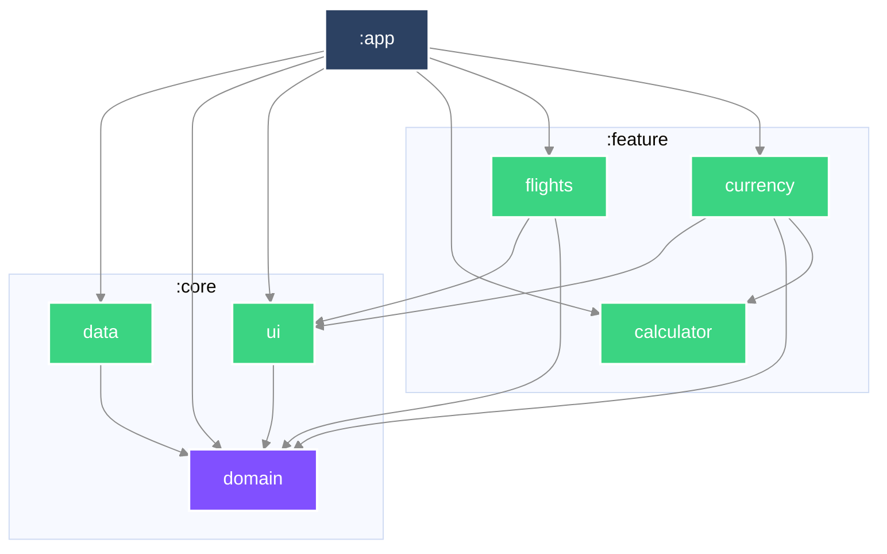

# 航班資訊

高雄國際航空站國內線到達看板，提供即時匯率換算與計算機。

- **Demo 影片**：https://www.youtube.com/watch?v=n8gBh9hrWUc
- **資料來源**：[高雄航空站即時時刻表](https://www.kia.gov.tw/Announce/NewsArea/InstantSchedule_DOMARR.json)、[freecurrencyapi](https://freecurrencyapi.com/)

航班頁以時間軸呈現到達資訊：連續導軌依整點插入標記，每班航班各有節點，下一班到達以放大節點標示。匯率頁為兩欄卡片網格，基準金額卡橫跨全寬；點選幣別可開啟計算機並即時換算。

## 執行

需要 JDK 17 與 Android SDK 37。

匯率 API 需要金鑰，請在專案根目錄的 `local.properties` 加入：

```properties
free_currency_api_key=你的金鑰
```

金鑰可於 [freecurrencyapi.com](https://freecurrencyapi.com/) 免費註冊取得。未填仍可建置與執行，但匯率頁會顯示錯誤；航班頁不需金鑰。

```bash
./gradlew build detekt lint                # 建置、靜態分析與 Android lint
```

## 需求對照

**基本**

- [x] 使用 Kotlin
- [x] MVVM
- [x] GitHub repository remote
- [x] Demo 影片

**必要**

- [x] 顯示航班資訊、狀態、時間
- [x] 資料每十秒更新一次，並支援手動刷新
- [x] 錯誤處理
- [x] 顯示六種以上幣別匯率，並可選擇基準幣別

**加分**

- [x] Coding Style 與分層架構
- [x] 狀態驅動的計算機：支援四則運算、優先序、括號與負號
- [x] Material 3、共享元素轉場、下拉刷新、骨架載入
- [x] 航班時間軸與匯率卡片網格
- [x] Jetpack Navigation 3：返回堆疊、預測返回與深連結
- [x] 依視窗尺寸切換底部導覽列、導覽 rail 或導覽 drawer
- [x] 使用第三方 library
- [x] 158 項 JVM 單元測試與 11 項 Android instrumentation 測試
- [x] 支援螢幕轉向與深色模式

## 架構

核心仍分三層，依賴指向內層，DTO 不越過資料層；各畫面依功能拆為獨立的 feature 模組。

```
:app                             MainActivity、FlightInformationApp、DI、導覽與 RotatableScaffold
├─ di/                            Hilt 綁定
├─ navigation/                    Navigation 3 back stack、deep link 與 nav entries
└─ component/                     共用 scaffold

:core:domain                     純 Kotlin JVM：模型、錯誤型別、repository 介面
├─ error/                         LoadError
├─ model/                         flights/、currency/
└─ repository/                    Repository 介面

:core:data                       Android library：網路、DTO、repository 實作
├─ datasource/                    currency/、flights/ 的 api、dto、url
├─ network/                       HttpClient 封裝與錯誤分類
└─ repository/                    DTO → domain 映射

:core:ui                         Android library：主題、LoadErrorMessages 與共享字串

:feature:flights                 航班畫面、時間軸、ViewModel、mapper、UI state 與 previews

:feature:currency                匯率畫面、卡片網格、圖示、ViewModel、mapper、UI state 與 previews

:feature:calculator              Android library：狀態驅動的計算機與 Compose view
```

依賴關係見下方產生的模組圖：`:app` 組裝 data、domain、ui 與三個 feature；`:core:data` 與 `:core:ui` 依賴 domain；航班 feature 依賴 ui 與 domain；匯率 feature 另依賴 calculator。`:core:domain` 是純 Kotlin JVM 模組，Android 與 Ktor 型別不在其編譯 classpath。

**資料流**

```
DTO ──(data mapper)──▶ domain model ──(presentation mapper)──▶ UI model
   狀態正規化                 業務事實              格式化、文案、顏色
```

導覽以 `androidx.navigation3` 的 `NavKey` back stack 驅動。 `flightinformation://flights` 與 `flightinformation://currency` 會建立對應的初始返回堆疊；Navigation Suite 依 window size class 選擇底部列、rail 或 drawer。

`airFlyStatus` 的中英混雜值在資料層收斂成 `FlightStatus`；未知值以 `Unknown(raw)` 保留。來源時間為不帶日期與時區的 `HH:mm`，因此以機場當地看板時間顯示，不做換算。

### 模組相依圖


### 抓取時機

航班資料在有畫面收集且資料失效時抓取。 `SharingStarted.WhileSubscribed` 讓沒有收集者時停止輪詢；資料新鮮期為十秒，使用者也可下拉刷新。刷新失敗時保留既有資料與上次成功的抓取時刻；沒有可顯示資料時才進入錯誤畫面。

### 錯誤處理

資料層將失敗收斂為 `LoadError`：`NoNetwork`、`Timeout`、`Server(code)`、`Malformed`、`Unknown`。`:core:ui` 將錯誤類別對應為字串資源，原始例外不會傳到畫面。

### 計算機

`:feature:calculator` 的計算機以 `CurrentState` 控制合法按鍵，採中綴轉後綴運算。支援四則運算、左結合優先序、括號巢狀與一元負號；該模組有 51 個單元測試。

## 測試

共有 158 個 JVM 單元測試與 11 個 Android instrumentation 測試。JVM／instrumented 分布為：`:app` 5／1、`:core:data` 22／0、`:feature:flights` 51／4、`:feature:currency` 29／6、`:feature:calculator` 51／0；`:core:domain` 與 `:core:ui` 目前沒有測試。

| 範圍 | 內容 |
|---|---|
| data | DTO 反序列化、HTTP 錯誤分類、DTO → domain 映射與匯率資料處理 |
| feature mapper | 航班狀態／時間與匯率金額的 UI 映射 |
| feature ViewModel | 載入、刷新、快取新鮮期、選取與錯誤狀態轉換 |
| calculator | 運算式、運算子優先序、括號、負號與輸入狀態矩陣（51 項） |
| Android UI | Navigation deep link、航班時間軸與匯率卡片網格的畫面行為 |

測試以 fake 與 Ktor `MockEngine` 隔離網路。編譯器警告視為錯誤（`allWarningsAsErrors`）；detekt 的規則與採用原因記於 `config/detekt/detekt.yml`。CI 在推送與 PR 執行 `./gradlew build detekt lint`。

## 技術

| 分類 | 使用 |
|---|---|
| 語言／建置 | Kotlin 2.3.21、AGP 9.1.0、Gradle 9.6.1、JDK 17 |
| Android | Core KTX 1.19.0、Lifecycle 2.11.0、Activity Compose 1.13.0 |
| UI | Jetpack Compose BOM 2026.06.01、Material 3、Adaptive Navigation Suite |
| 導覽 | Jetpack Navigation 3 1.1.4（runtime、ui） |
| 非同步／狀態 | Coroutines、Flow、kotlinx-collections-immutable 0.5.1 |
| 網路／序列化 | Ktor 3.5.1（OkHttp engine、MockEngine）、kotlinx.serialization 1.11.0 |
| DI | Hilt 2.60.1、Hilt Navigation Compose 1.4.0、KSP 2.3.10 |
| 圖片 | Coil 3.5.0 |
| 測試 | JUnit 4.13.2、kotlinx-coroutines-test 1.11.0、Turbine 1.2.1、AndroidX JUnit 1.3.0、Espresso 3.7.0 |

Compose UI、Material 3、animation、foundation 與 Compose 測試 artifact 的版本由 Compose BOM 管理；version catalog 未為它們重複釘選版本。

## 決策紀錄

上方的模組相依圖由 `./gradlew createModuleGraph` 依實際相依關係產生，不手動維護。

架構上的取捨記於 [`docs/adr/`](docs/adr/)。

程式碼導讀見 [`docs/code-reading-guide.md`](docs/code-reading-guide.md)。

分支與提交慣例見 [`docs/git-conventions.md`](docs/git-conventions.md)。
